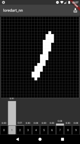
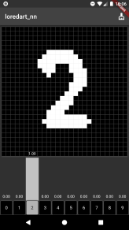
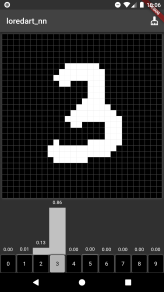
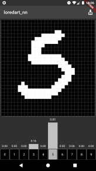

Small library for creating, training, saving and loading DNNs (for now MLPs and CNNs), written in pure Dart.

## _LoreDart NN_

This is an updated (and much better) version that is not compatible with previous versions.

Conceptually, the library has educational and entertainment purposes. Hope you will find it fun to train DNNs with `loredart_nn`.

The API of the library is mostly inspired by Keras and TensorFlow, most of the NN operations and gradients calculations were tested to have close values to a corresponding logic from TF.

All computations are based on Tensors from `loredart_tensor`.

## Getting started

Just import the library into the project.
```
import 'package:loredart_nn/loredart_nn.dart';
```

## Model usage basics

The main class for creating neural networks is `Model` that contains an ordered list of layers, optimizer, loss and optional metrics (basically it's a combined initialization and compilation of the Model in terms of Keras/TF).

### Creating neural network with `Model` class

```dart
  final model = Model(
    [
      Dense(128, activation: ReLU()),
      Dense(10)
    ],
    optimizer: Adam(),
    loss: CategoricalCrossentropy(fromLogits: true),
    metrics: [Metrics.categoricalAccuracy],
  )
```

If model is built, one can print its summary:
```dart
  print(model); // or print(model.summary());
  // ________________________________
  // Layer     Output shape   Param #
  // ================================
  // Dense-1   [128]          100480
  // Dense-2   [10]           1290
  // ================================
  // Total trainable params: 101770
  // ________________________________
```

The models are not built (populated with weights) before the shape of the input is known (excluding batch size), and there are four main ways of building a model:
- add `inputShape` in constructor
- explicitly call `build` method
- call model for predictions with some data
- or start training

Note: all `Layer`s and `Model` are batch-first computations and always expect to see batched Tensor.

### Training, evaluation and prediction

As one would expect, to train the model we need to call the `fit` method with training data (Tensors `x` and `y`) and number of epochs, additionally one can add validation data or control the batch sizes:

```dart
  history = model.fit(
    x: xTrain,
    y: yTrain,
    epochs: 2,
    batchSize: 64,
    validationData: [xVal, yVal],
  )
```

With `verbose: true` (default) fitting will print some progress logs:

```
Straining model training
Epoch 1/2:
125/125 - [=====] - 6 s - 54 ms per step - loss: 0.6042 - categorical_accuracy: 0.7402 - val_loss: 0.6465 - val_categorical_accuracy: 0.7935
Straining model training
Epoch 2/2:
125/125 - [=====] - 6 s - 51 ms per step - loss: 0.4763 - categorical_accuracy: 0.8905 - val_loss: 0.4655 - val_categorical_accuracy: 0.8647
```

Returned history is just a Map with names of the metrics and value per epoch.

```dart
  print(history);
  // {loss: [0.5919618010520935, 0.5008291006088257], categorical_accuracy: [0.68, 0.888625], val_loss: [0.6536273518577218, 0.467515311203897], val_categorical_accuracy: [0.8154296875, 0.8603515625]}

```


Each `Layer` of the Model (and model itself) applies its logic via the `call` method. If `training` is set to `true` (default for fitting) - Layers will use training logic and also construct the gradient function.
To use inference mode one should set `training: false` or use `model.evaluate` and `model.predict` for evaluation and prediction respectively.

```dart
  final evalResults = model.evaluate(x: xTest, y: yTest, batchSize: 128);
  //  16/16 - [=====] - 0 s - 32 ms per step - loss: 0.4589 - categorical_accuracy: 0.8615

  print(evalResults); // {loss: 0.471101189032197, categorical_accuracy: 0.8615234382450581}

```

Prediction method also supports batching and has some auto-batch-selection logic inside:
```dart
  final preds = loadedModel.predict(x); // or set batchSize: 64
```

### Saving and loading model
In the updated version of the library only the Json-based model serialization is supported, that save Model's structure (including optimizer, loss, metrics) and weights of the Layers (as well as hyperparams like whether to use bias, weights initialization etc.).

```dart
  File f = File('mnist_classifer.json');
  f.writeAsStringSync(jsonEncode(model.toJson()));
```

Then one can load Model back:

```dart
  final model = Model.fromJson(jsonDecode(f.readAsStringSync()));
```

Note: all Layers, Losses, Optimizers and other components have serialization logic, so one can serialize individual components. However, Optimizer DO NOT serialize internal states (e.g. momentums), so uploading a model to continue training is not correctly supported by now, but fine-tuning will work just fine.

## Flutter example with classification model
Simple example of using MNIST classifier within Flutter app loaded from Json asset.

   

### Models as Layers

Because `Model` is derived from the `Layer` class, one can create nested models or use this for grouping Layers into blocks.

For instance, one can create AutoENcoder with separate encoder and decoder:
```dart
Model encoder = Model(
  [Dense(128), ActivationLayer(ReLU()), Dense(32)],
  optimizer: SGD(), // will be ignored
  loss: MeanSquaredError(), // will be ignored,
  name: 'Encoder',
);
Model decoder = Model(
  [Dense(128), ActivationLayer(ReLU()), Dense(784)],
  optimizer: SGD(), // will be ignored
  loss: MeanSquaredError(), // will be ignored,
  name: 'Decoder',
);

final ae = Model(
  [encoder, decoder],
  loss: MeanSquaredError(),
  optimizer: Adam(),
  inputShape: [784],
);

print(ae);
// ________________________________
// Layer     Output shape   Param #
// ================================
// Encoder   [32]           104608
// Decoder   [784]          105360
// ================================
// Total trainable params: 209968
// ________________________________
```

## Supported NN components

### Layers and activation functions
For now `loredart_nn` supports main `Layers` needed for creation of MLPs and CNNs, including _linear_ layer, different _reshaping_ layers, _1D_ and _2D convolutions_ and _poolings_, and one normalization layer - `LayerNormalization`. Each `Layer` is available as a separate class.

Additionally for trainable layers the set of simple and popular initializers is available.

There are 10 supported activation functions. Each of the activation func can be used as separate class (e.g., `ReLU()` or `Softmax()`) or from a unified collection of `Activations` (for instance `Activations.elu` or `Activations.softplus`).

### Losses and metrics

Most popular `Loss` functions are supported, including _crossentropies_ (_binary_ and _categorical_, with _sparse_ version too), as well as regression metrics: _MSE_, _MAE_ and _LogCosh_. `Loss`es can only be accessed as classes, for instance `MeanSquaredError()`.

While for metrics there is a collection, allowing easier selection of those for model, e.g., `Metrics.mse` or `Metrics.binaryAccuracy`.

### Optimizers

As for optimizers, right now 4 are available, and all of them support _weight decay_:
- `SGD` - with and without momentum
- `Adam` (and `AdamW`)
- `AdaBelief`
- and `Lion`

## Information about implementation and limitations

First of all, the library is not efficient and training (esp with Conv layer) can be very slow:
 - there is no parallelism for CPU training
 - there is GPU support
 - the gradients are computed via implicitly linear computational graph that is rebuilt for each training step

Second point - even if it's possible to extend the library to more modalities and support more interesting Layers, the slow training will kill the joy of using the library. But maybe later libraries (nn or tensor) will be updated to support some kind of computation acceleration and more Neural Networks will be supported.

Even so, almost all of the public API is fully documented, so one can easily write their own `Layer`s and `Activation`s or other components if needed.

Other pain point - is working with training data. THis package does not provide any good utilities for loading datasets as `Tensor`s, supported by Models, so it's on user to pre-load data from files. See example code for one of the ways to load data from csv and converting it into `Tensor`s.
---
>  If you would like to support UKRAINE with a donation, visit [**UNITED24**](https://u24.gov.ua/) for more info. Thanks.